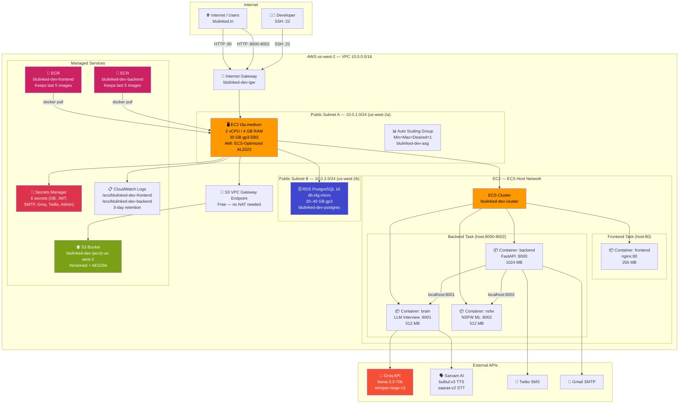
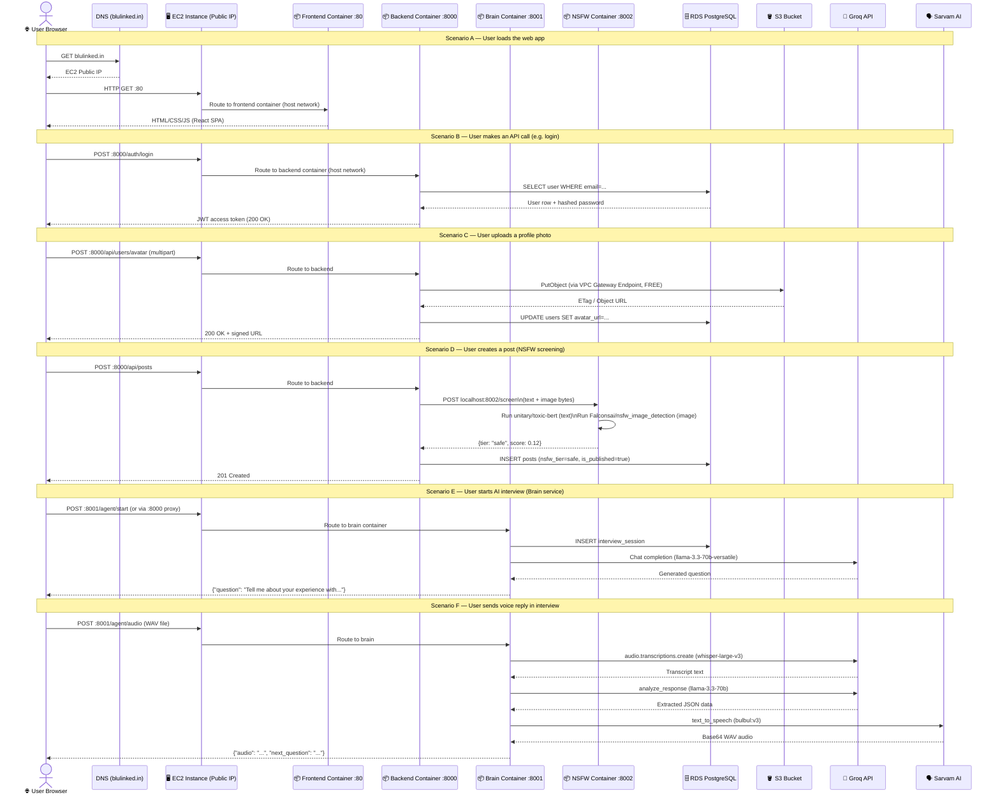
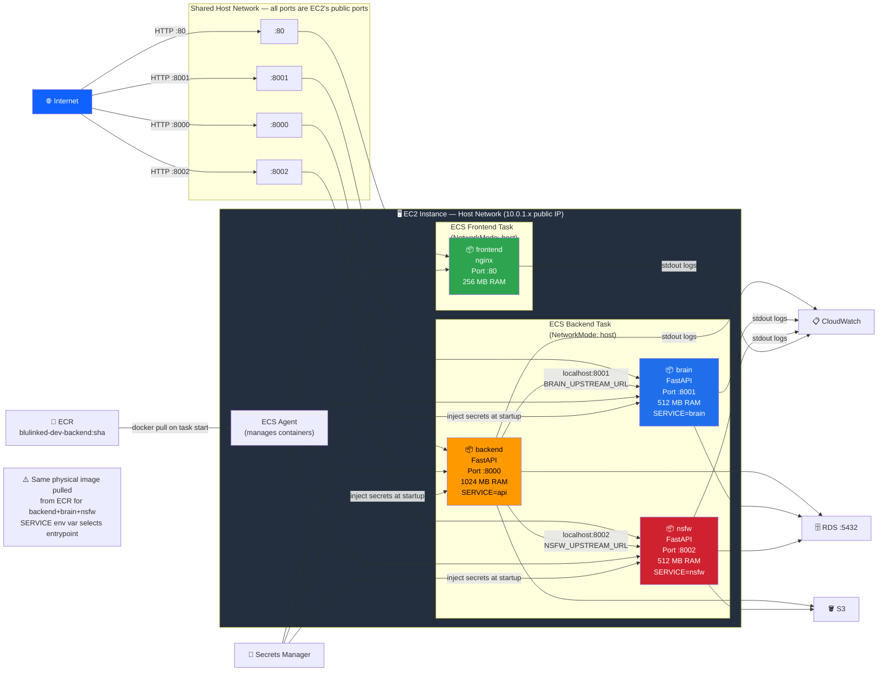

# Blulinked DEV — Architecture & Flow Diagrams
> Based on `infrastructure/cft-dev.yaml` and `.github/workflows/deploy-dev.yml`  
> Region: **us-west-2 (Oregon)** | Compute: **Single EC2 t3a.medium** running ECS on EC2 launch type

---

## Diagram 1 — Full Infrastructure Overview

This shows every AWS resource created by `cft-dev.yaml` and how they're connected.

---

## Diagram 2 — CI/CD Pipeline: What Happens When You Push to `main`

This maps every job in `deploy-dev.yml` in order.

```mermaid
flowchart TD
    Push["⬆️ git push to main\n(or workflow_dispatch)"]

    Push --> J1

    subgraph J1["Job 1: ensure-infra (sequential, blocks all others)"]
        direction TB
        S1["📸 Snapshot EC2 instance ID + IP\n(before any changes)"]
        S2{"Does CloudFormation\nstack exist?"}
        S3_new["create-stack\nusing cft-dev.yaml\n+ all Parameters/Secrets"]
        S3_upd["update-stack\nusing cft-dev.yaml"]
        S3_skip["No changes\n→ skip"]
        S4["⏳ Wait for stack\ncreate/update complete"]
        S5{"EC2 instance ID\nchanged?"}
        S6["✅ Same instance\nIP is stable"]
        S7["❌ FAIL\nEC2 replaced!\nManual DNS update needed"]

        S1 --> S2
        S2 -->|"DOES_NOT_EXIST"| S3_new
        S2 -->|"CREATE/UPDATE_COMPLETE"| S3_upd
        S3_upd -->|"No updates"| S3_skip
        S3_new --> S4
        S3_upd --> S4
        S4 --> S5
        S5 -->|"Same"| S6
        S5 -->|"Different"| S7
    end

    J1 --> J2

    subgraph J2["Job 2: test (runs after ensure-infra)"]
        direction TB
        T1["✅ Check required files\n(Dockerfile, requirements.txt, etc.)"]
        T2["✅ Dockerfile syntax check\n(docker build --check)"]
        T3["✅ Frontend build check\n(npm ci + npm run build + dist check)"]
        T4["✅ Backend syntax check\n(py_compile main.py + config.py)"]
        T1 --> T2 --> T3 --> T4
    end

    J2 --> J3A & J3B

    subgraph J3A["Job 3a: build-backend (parallel)"]
        direction TB
        B1["Login to ECR"]
        B2["docker build -f Backend/Dockerfile\ntag: :sha + :latest"]
        B3["docker push to ECR\nblulinked-dev-backend"]
        B4["Output: image_uri"]
        B1 --> B2 --> B3 --> B4
    end

    subgraph J3B["Job 3b: build-frontend (parallel)"]
        direction TB
        F1["Login to ECR"]
        F2["Get EC2 public IP\nfrom ASG"]
        F3["docker build with VITE_API_BASE_URL=http://EC2_IP:8000\nVITE_BRAIN_API_URL=http://EC2_IP:8001\nVITE_WS_URL=ws://EC2_IP:8000"]
        F4["docker push to ECR\nblulinked-dev-frontend"]
        F5["Output: image_uri"]
        F1 --> F2 --> F3 --> F4 --> F5
    end

    J3A & J3B --> J4 & J4B

    subgraph J4["Job 4: deploy (runs after build jobs)"]
        direction TB
        D1["Fetch current backend task def JSON"]
        D2["jq: replace image for backend+brain+nsfw\nall 3 containers use same ECR image\n(SERVICE env var picks the process)"]
        D3["Register new task definition revision"]
        D4["ecs update-service backend\n--desired-count 1\n--force-new-deployment"]
        D5["Fetch current frontend task def JSON"]
        D6["jq: replace frontend container image"]
        D7["Register new frontend task revision"]
        D8["ecs update-service frontend\n--desired-count 1"]

        D1 --> D2 --> D3 --> D4
        D4 --> D5 --> D6 --> D7 --> D8
    end

    subgraph J4B["Job 4b: vulnerability-scan (parallel, non-blocking)"]
        direction TB
        VS1["Install Trivy scanner"]
        VS2["Scan backend image\n(CRITICAL only, exit-code 0)"]
        VS3["Scan frontend image\n(CRITICAL only, exit-code 0)"]
        VS4["Full HIGH/MEDIUM report\n(informational only)"]
        VS1 --> VS2 --> VS3 --> VS4
    end

    J4 --> J5

    subgraph J5["Job 5: verify (runs after deploy + ensure-infra)"]
        direction TB
        V1["⏳ Poll ECS services\nevery 30s up to 10min\nuntil running=desired, pending=0"]
        V2["Get final EC2 IP from ASG"]
        V3{"EC2 IP changed\nfrom pre-deploy?"}
        V4["❌ FAIL — DNS stale"]
        V5["✅ IP stable"]
        V6["Health checks with retries\n:80 → frontend\n:8000/health → backend\n:8001/health → brain\n:8002/health → nsfw (503 OK)"]
        V7["Smoke tests\nHTML served, /docs 200,\nJSON health, DNS check"]
        V8["📋 Print URLs + GitHub Step Summary"]

        V1 --> V2 --> V3
        V3 -->|"Changed"| V4
        V3 -->|"Same"| V5
        V5 --> V6 --> V7 --> V8
    end

    style Push fill:#2EA44F,color:#fff
    style J1 fill:#1F6FEB,color:#fff
    style J2 fill:#6F42C1,color:#fff
    style J3A fill:#E36209,color:#fff
    style J3B fill:#E36209,color:#fff
    style J4 fill:#CF222E,color:#fff
    style J5 fill:#1A7F37,color:#fff
```

---

## Diagram 3 — Runtime Request Flow (Internet → EC2 → Services → S3/RDS)

How a real user request travels through the system after deployment.

---

## Diagram 4 — Container Communication Inside EC2 (Host Networking)

All 4 containers share the EC2 host network. They all talk via `localhost`.

---

## Key Facts Summary

| Aspect | Detail |
| :--- | :--- |
| **Region** | us-west-2 (Oregon) |
| **Compute** | 1× EC2 t3a.medium (2 vCPU, 4 GB, 30 GB EBS gp3) |
| **Networking** | ECS `host` network mode — all containers share EC2's IP |
| **Backend images** | All 3 backend containers (`backend`, `brain`, `nsfw`) use the **same ECR image** — `SERVICE` env var selects which process to start |
| **EC2 IP stability** | ASG min=max=1, no IP recycling — `deploy-dev.yml` checks that instance ID doesn't change between jobs and fails loudly if it does |
| **S3 Access** | Free via VPC Gateway Endpoint — no data transfer cost |
| **Secrets** | Injected at container startup via ECS Secrets from Secrets Manager |
| **Logs** | 3-day CloudWatch retention (dev cost saving) |
| **ECR Lifecycle** | Keep last 5 images only (dev reduces storage cost) |
